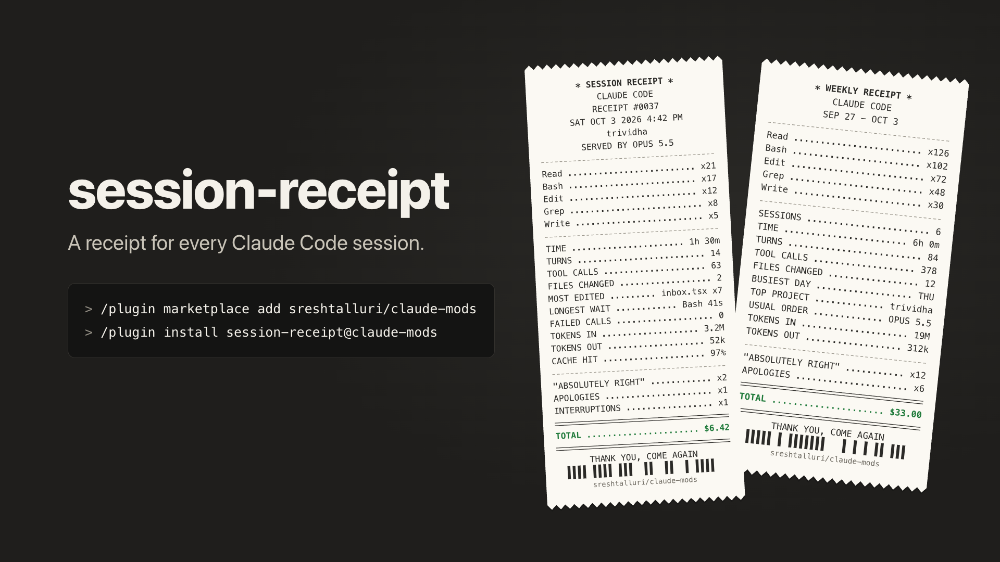

# claude-mods

Claude Code mods by [@sreshtalluri](https://github.com/sreshtalluri).



## Install

```
/plugin marketplace add sreshtalluri/claude-mods
/plugin install session-receipt@claude-mods
/plugin install daily-grind@claude-mods
```

Mods use Claude Code's function-hooks plugin API, which is early access, so you need a current Claude Code.

## Mods

| Mod | What it does |
| --- | --- |
| [session-receipt](#session-receipt) | `/receipt` prints a shareable receipt of your session. `/receipt week` totals your week. **Copy image** gives you a square PNG to post. |
| [daily-grind](plugins/daily-grind) | `/grind` opens a hub of daily puzzles to play while Claude works. **Developer:** Git Golf (reshape a commit graph under par), Heisenbug (find the buggy line), Install Order (dependency logic). **Everyone:** Ladder, Pixel Logic, Codebreaker. A **Classics** tab holds Lexer, Buckets and Daemons. Streaks, and `/grind share` for a shareable result. |

### session-receipt


| Command | |
| --- | --- |
| `/receipt` | This session: model, time, turns, tools, files, tokens, cache hit, cost, and how many times Claude said you were absolutely right. |
| `/receipt week` | The last seven days: sessions, busiest day, top project, usual model, total. |
| `/receipt last` | The previous session's receipt. |

- **Copy image** puts a 1200×1200 PNG on your clipboard on macOS, Windows and Linux. If nothing can draw it, the image is saved and its path is shown.
- Every session's receipt is saved to `~/.claude/receipts/` when it ends. Nothing leaves your machine.
- In the terminal it's a text slip; in the desktop app it's drawn as paper.

## Adding a mod

1. Put it in `plugins/<name>/` (with `.claude-plugin/plugin.json`).
2. Add an entry to `.claude-plugin/marketplace.json`.
3. `claude plugin validate plugins/<name>`, `claude plugin test plugins/<name>` and `claude plugin validate .`

The demo clip is a [HyperFrames](https://github.com/heygen-com/hyperframes) composition in `media/receipt-demo`: `bun build.ts && npm run render`.

## License

MIT
